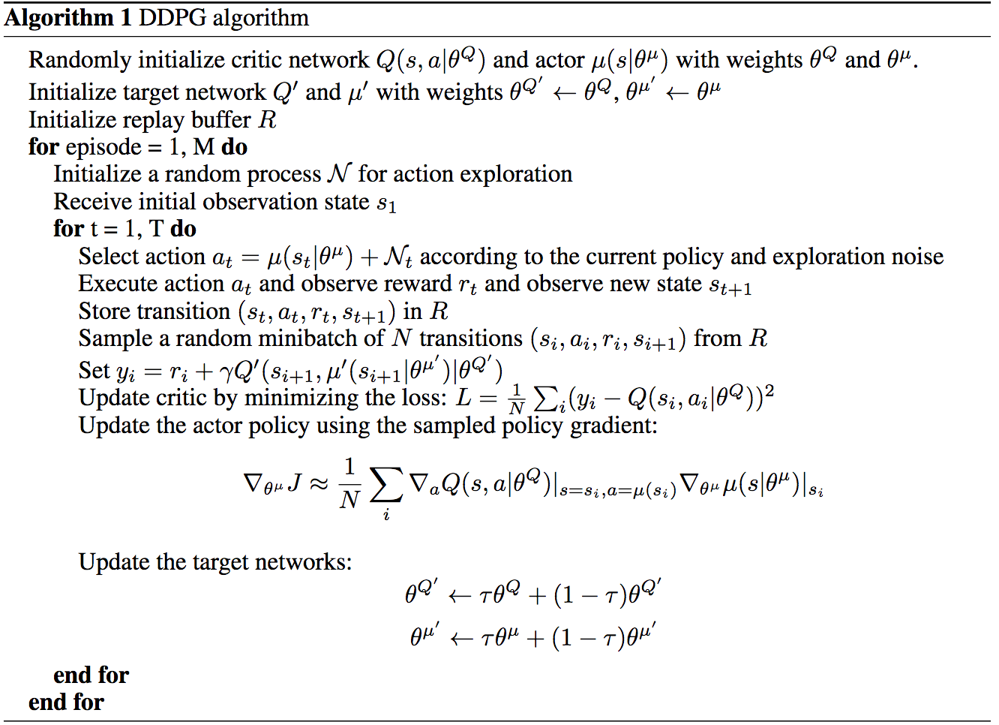
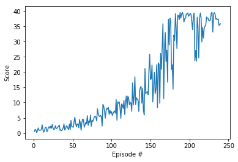

# Project Continuous Control: Report

## Goal

The goal of this project was to train an agent to solve the provided [Unity Reacher](https://github.com/Unity-Technologies/ml-agents/blob/master/docs/Learning-Environment-Examples.md#reacher) environment.

In this environment, a double-jointed arm can move to target locations. A reward of +0.1 is provided for each step that the agent's hand is in the goal location. Thus, the goal of your agent is to maintain its position at the target location for as many time steps as possible.

The observation space consists of 33 variables corresponding to position, rotation, velocity, and angular velocities of the arm. Each action is a vector with four numbers, corresponding to torque applicable to two joints. Every entry in the action vector should be a number between -1 and 1.

The goal is to solve one of the two versions of the environment.
- Option 1: Solve the First Version

The task is episodic, and in order to solve the environment, your agent must get an average score of +30 over 100 consecutive episodes.
- Option 2: Solve the Second Version

The barrier for solving the second version of the environment is slightly different, to take into account the presence of many agents. In particular, your agents must get an average score of +30 (over 100 consecutive episodes, and over all agents). Specifically,

i) After each episode, we add up the rewards that each agent received (without discounting), to get a score for each agent. This yields 20 (potentially different) scores. We then take the average of these 20 scores.

ii) This yields an average score for each episode (where the average is over all 20 agents).

The environment is considered solved, when the average (over 100 episodes) of those average scores is at least +30. 

## Solution

### Algorithm Description

I have obtained the solution to the problem by using the Deep Deterministic Policy Gradients (DDPG) algorithm ([Lillicrap et al. 2016]( https://arxiv.org/pdf/1509.02971.pdf)). The algorithm is based on extending the Deep Q-Learning framework to the continuous action domain. The authors describe the DDPG as an actor-critic, model-free algorithm based on the deterministic policy gradient that can work in continuous action spaces. The snapshot of the algorithm from the paper itself is shown below.



The code which I used is based on the Udacity DDPG implementation applied to the OpenAI Gym's Pendulum environment available at this [link](https://github.com/udacity/deep-reinforcement-learning/tree/master/ddpg-pendulum). First, I have adopted the code for the Unity environment (in [Continuous_Control.ipynb](Continuous_Control.ipynb)) and then I have tuned the network architectures and the DDPG algorithm hyperparameters to achieve the goal of the agent learning: a reward of at least 30 averaged over the last 100 episodes.

I have mostly worked with the first version of the environment (one agent) given that the second version is useful for algorithms like PPO, A3C, and D4PG that use multiple (non-interacting, parallel) copies of the same agent to distribute the task of gathering experience. 

Initially, I have started the agent training by applying the DDPG hyperparameters described in the [DDPG paper](https://arxiv.org/pdf/1509.02971.pdf) using the exact code for the network and DDPG algorithm as in the Udacity Pendulum application. I have also implemented suggestions from the class meant to stabilise the learning: 
- 1. use gradient clipping when training the critic network implemented as following:
```
      self.critic_optimizer.zero_grad()
      critic_loss.backward()
      torch.nn.utils.clip_grad_norm(self.critic_local.parameters(), 1)
      self.critic_optimizer.step()
```
- 2. smaller number of updates per time step: instead of updating the actor and critic networks 20 times (for 20 agents) at every timestep, amend the code to update the networks 10 times after every 20 timesteps. 

However, the learning of the agent was very slow and even with a further tweaking of some of the hyperparameters after 500 episodes with 1000 steps each the reward averaged over the last 100 steps was still of the order below 10. Therefore I focussed on speeding up the learning process by going away from using the same parameters as in the paper itself.

In my case, I have found that the training speed and convergence improved by:
- lowering the number of nodes in the hidden network layers
- batch normalising the networks layers - this was already used in the [DDPG paper](https://arxiv.org/pdf/1509.02971.pdf)
- copying the weights from the local to the target network in the initilisation step for both the actor and critic networks, respectively      (e.g.https://towardsdatascience.com/deep-deterministic-policy-gradients-explained-2d94655a9b7b)
- tuning the noise parameters by supressing the level of exploration in the learning process. Though the used Ornstein-Uhlenbeck noise exploration process itself is constructed in such a way to decrease to mean over time (which was set by the \mu parameter to zero) the improvement was also achieved by using the additional decay parameters of the noise contribution. For the noise contribution decay I have used the implementation in the DDPG algorithm in https://github.com/samlanka/DDPG-PyTorch.

The less frequent updates within a given episode (the second suggestion from the Udacity team solution) was not really helpfull for my combination of parameters (environment with single agent) and I have dropped it - i.e. the update was carried out at each time step. 


## Final set-up

The final set-up is the solution for the "First Version" of the Reacher environment with one agent.  

### Actor and Critic Networks Architectures (code model.py)

 The final layer weights and biases of both the actor and critic were initialized from a uniform distribution [−3×10−3,3×10−3].  As described in the DDQN paper, the reason for this was to garantee that the initial outputs for the policy and value estimates are close to zero. The rest of the network layers were initialized from uniform distributions [−1√f,1√f] where f is the fan-in of the layer. The actions in the Critic network were included in the second hidden layer. 

The actor (policy) network maps states to actions with the following structure:
 ```
    State input: 33 units
    First hidden layer: 128 units with ReLU activation and batch normalization
    Second hidden layer: 128 units with ReLU activation and batch normalization
    Action output: 4 units with tanh activation
```

The critic (value) network maps (state, action) pairs to Q-values with the following structure:
```
    State input: 33 units
    First hidden layer: 128 nodes with ReLU activation and batch normalization
    Second hidden layer:  Action input 4 units + 128 units from the first hidden layer with ReLU activation 
    Q-value output: 1 node with ReLU activation
```


### DDQN Hyperparameters (code ddqn_agent.py)

There were multiple hyperparameters which could be changed during the training process. In my experiments, lowering SIGMA in the Ornstein-Uhlenbeck process as well as decreasing the noise contribution over time by using the EPSILON and EPSILON_DECAY parameters had most influence on the convergence of the results. Maximum number of time steps per episode was set to 1000. 

```
BUFFER_SIZE = int(1e6)  # replay buffer size
BATCH_SIZE = 128        # minibatch size
GAMMA = 0.99            # discount factor
TAU = 1e-3              # for soft update of target parameters
LR_ACTOR = 1e-4         # learning rate of the actor 
LR_CRITIC = 1e-4        # learning rate of the critic
WEIGHT_DECAY = 0        # L2 weight decay
SIGMA = 0.1             # Ornstein-Uhlenbeck noise parameter
THETA = 0.15            # Ornstein-Uhlenbeck noise parameter
EPSILON = 1.0           # explore to exploit noise process added to act module
EPSILON_DECAY = 1e-6    # decay rate for noise process
```


### Results

Using the set-up described above the single Reacher agent was able to achieve the score of at least 30 over the last 100 episodes 
at the episode 240. The plot showing the learning process is shown below. 




### Future work ideas

This work should be extended in two different directions:
1. More systematic exploration of the hyperparameters - in this work I have found that lowering the degree of the exploitation helped to speed the learning. However, more systematic parameter tuninig would probably lead to the more optimal solution. 
2. I have solved the environment using the DDPG algorithm. This algorithm was introduced as using the "Actor-Critic" method, however, this algorithm can be also classified as a DQN method for continuous action spaces. One should solve the environment with another, more "native" actor-critic algorithm such as A3C Asynchronous Advantage Actor-Critic, A2C Advantage Actor-Critic or GAE Generalized Advantage Estimation or with the PPO Proximal Policy Optimization method.


## References:
1. This report is mainly based on the learning material of the [Udacity Deep Reinforcement Learning Nanodegree Program](https://eu.udacity.com/course/deep-reinforcement-learning-nanodegree--nd893) and references therein.
2. Lillicrap et al. 2016, https://arxiv.org/pdf/1509.02971.pdf
3. https://towardsdatascience.com/deep-deterministic-policy-gradients-explained-2d94655a9b7b
4. https://sameera-lanka.com/blog/2018/2/19/deep-deterministic-policy-gradientpytorch-dm-control-suite
5. https://github.com/ShangtongZhang/DeepRL

